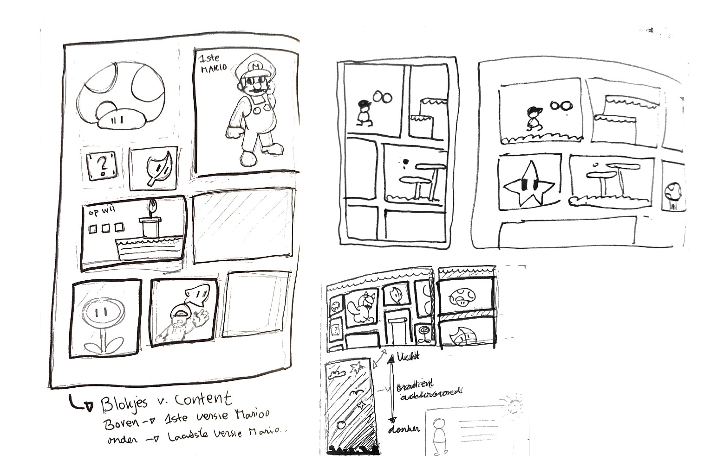
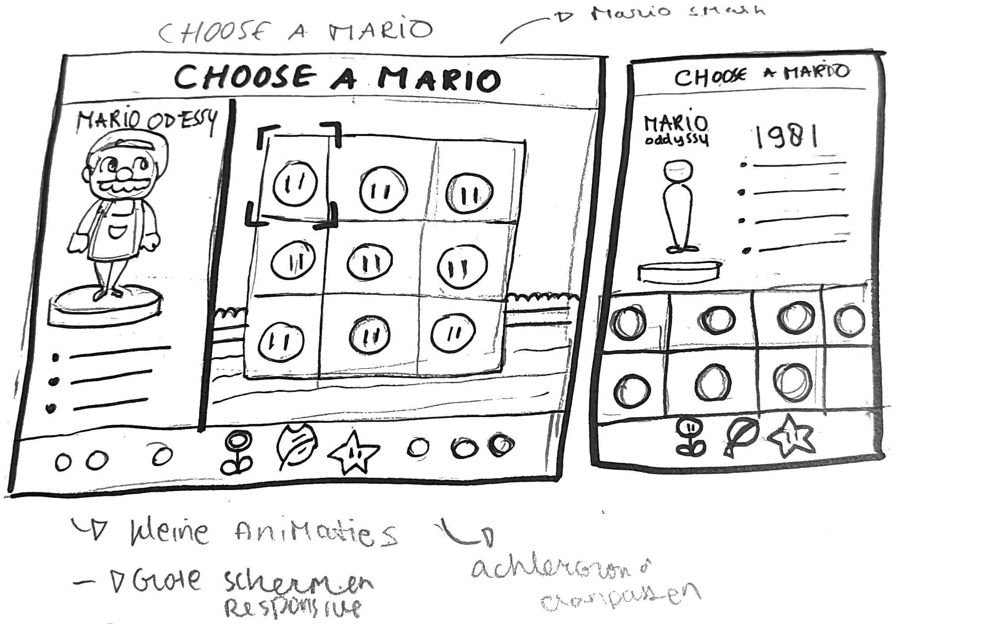
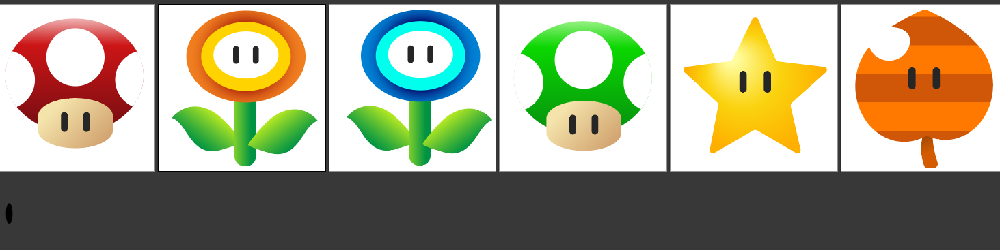
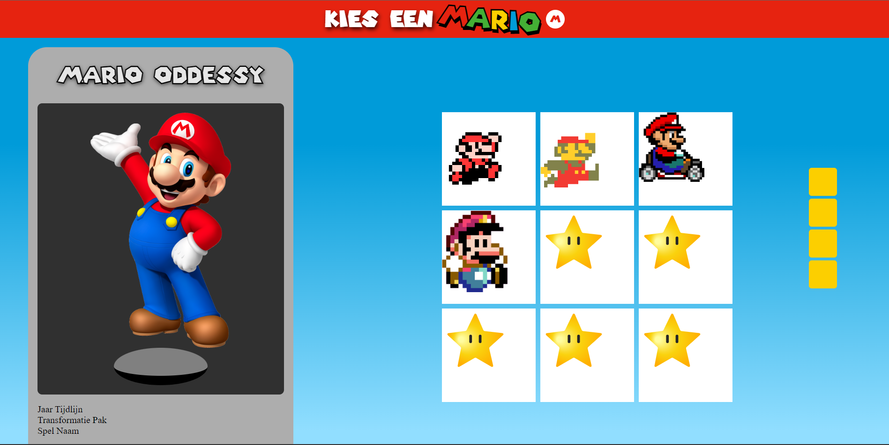
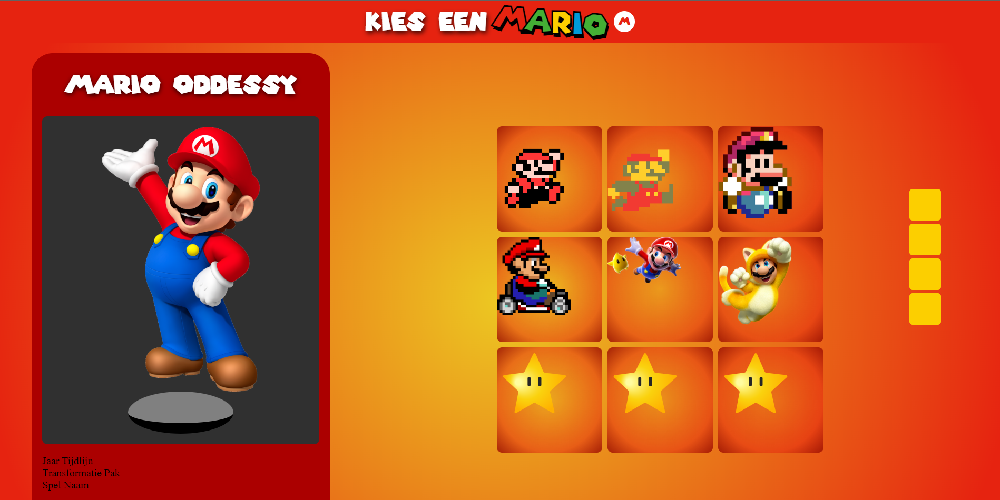
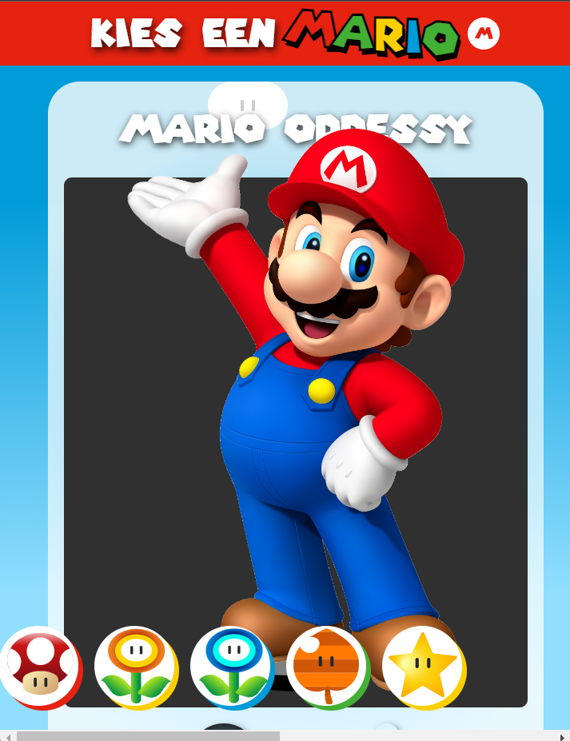

# Procesverslag


## Jij

### Ontwerper:
Keïsha Alexander

#### Je startniveau:
Blauw


# Je plan

<details open>
  <summary>De eerste versie/schets van je ontwerp & je persoonlijke uitdaging</summary>


  ### De eerste versie schets:
  


### Mijn idee 1ste versie
Wat Mario uniek maakt is de mogelijkheid te transformeren met behulp van magische bloemen en producten. En dat wil ik ook toevoegen in mijn eigen werk.

De pagina bestaat van enkele blokken van afbeelding en animatie. 
 De blokken bevatten  afbeelding van Mario in verschillende kostuums, maar ook versies van zijn originele pak.  Aan de bovenste gedeelte heb je de nieuwste versie van mario met daarbij bijbehorende functionaliteiten. En hoe meer je naar beneden scrolt hoe ouder de versie wordt.

Als je op de content krijg je meer informatie te zien die bijhoort of kleine animaties met geluid erachter.

In de achtergrond heb je een kleurverloop van een lichte kleur naar een donkere kleur.


### Mijn idee versie 2


Wat Mario uniek maakt is de mogelijkheid te transformeren met behulp van magische bloemen en producten. En dat wil ik ook toevoegen in mijn eigen werk.

Het is de beginscherm van een spel waar je een karakter gaat kiezen. In mijn geval zijn de karakters verschillende  versies  van Mario's.

Dit geef aan de tijdlijn aan, bijvoorbeeld als je op een versie klikt dan verandert de achtergrond van het spel uit die tijd.  Aan de linkerkant staat de details van de gekozen karkater met daarbij de power up pak, de spel waar die mario vandaan komt en de jaartaal van de spel.

Aan de andere kant heb je onderaan de power ups die ervoor zorgen dat Mario kan transformeren.


  ### Je ambitie: 
  Aan deze technieken/punten wil ik werken:
 - Animeren met afbeeldingen zoals png en svg 
 - Ik wil geluid van Mario toevoegen binnen een animatie.
 - Firguurtjes kunnen maken met puur css.
 - Website interactiever maken met javascript
 
</details>


## Voortgang/Feedback 1

<details>
  <summary>Mijn bevindingen + wijzigingen (minimaal 5)</summary>

  ### Bevinding 1:
  In mijn eerste schets had ik niet een sterke progressive disclosure toegepast omdat en die moest ik beter gaan uitwerken. 
  

  #### oplossing:
  Dit zou ik oplossen door de kaarten te flippen en aan de achterkant een korte informatie schrijven van de Mario versie. 
  Of na elke versie een andere variant van de Maro met daarbij een bijbehorende functionaliteit van de mario spel. 


  ### Bevinding 2:
  In mijn eerste ontwerp heb ik te horen dat de layout te complex zou zijn als ik ga het responsive maken.

  #### oplossing:
 Als oplossing ga ik  bijvoorbeeld een drie kolommen layout pagina maken waar de vakken verdeeld zijn in drie kolommen. 

### Bevinding 3
Als je op de power-ups klikt, gebeurt er iets in de achtergrond met de passende geluid.

### oplossing:
Ik ga bijvoorbeeld  aan de onderkant bij de footer een soort van menu maken met verschillende optie waar de gebruiker kan erop klikken. Als hij bijvoorbeeld op een van de power ups klikt dan kwam een soort van knipperende regeboog kleur met wat geluid erachter. 

### Bevinding 4:
 Ik heb mijn eerste schets aan een medestudent laten zien en zij vond het goed en passend bij het concept maar er miste de leemnrt van Mario erin. Want nu lijkt het meer van een stripboek dan een video game. Want ik wil naar voren laten brengen hoe Mario kan zich transformeren in verschillende kostuums door midel van power-ups.

### oplossing:


Door die idee naar voren te laten brengen heb ik een nieuwe schetsen gemaakt. Mijn idee is een soort van een kies karakter spel. Waar de gebruiker verschillende Mario's kan kiezen (tijdlijn) en dan aan de linkerkant zie je meer details over de gekozen karakters. Verder kun je 


### Bevinding 5
 Ik heb de powerup menu gemaakt op illustrator. Dan was het makkelijk om een svg van te maken. Ik heb op internet gezocht aan verschillende power-ups waar Mario zich kan transformeren.

 

</details>


## Voortgang/Feedback 2

<details>
  <summary>Mijn bevindingen + wijzigingen (minimaal 5)</summary>
  
  ### Bevinding 1:
   

 Mijn ontwerp lijkt niet als een geheel. Dat betekent dat er geen samenhang was in het kleurenpallette. Bijvoorbeeld hier en daar had ik ronde hoeken  bij de nintendo switch en  de mario menu was er te maken met scherpe hoeken.
 
 Er waren verschillende kleuren die ik heb gebruikt, en die niet paste bij elkaar zoals de grijs achter de licht blauwe achtergrond. 

  #### oplossing: 
Ik heb ten eerste een kleur gezocht die passend is bij mario. Verder heb ik gezocht aan de begin scherm van een mario spel. En rood kwam meest naar voren.


   

   Ik heb de blauwe kleurverloop verandert in rood oranje kleur.  De mario menu heb ik de blokjes transparant gemaakt met een rode kleurverloop.

   De nintendo switch heb ik een bordeaux kleur gegeven zodat het past bij de thema.


   Verder vond ik de kleur te fel, dus ik heb de achtergrond kleur van de body weer verandert naar blauw. Want het past beter bij de mario wereld spel.
   Verder heb ik de alle vormen een ronde hoek gegeven zodat het past elkaar. 

  ### Bevinding 2: Responsiveness
Volgende stap voor mijn ontwerp is de onderdelen responsive te maken. Ik was eerst van plan om het responsive te maken bij grotere schermen. Maar daarna heb ik besloten om ook voor kleine schermen te maken.

  


  #### Oplossing:
Ik heb gebruikt gemaakt van media queries. Waar ik de flex-direction verandert van row naar een column;

```
@media (max-width: 50em) {
  body {
    overflow: auto;
  }

  main {
    display: flex;
    flex-direction: column;
  }

 
}

```

  ### Bevinding 3: Progressive disclosure 
  Om  progressive disclosure toe te voegen wilde ik de nintendo verbergen en dan met een knop wil zichtbaar maken. Met die
  Tijdens mij tweede gesprek met Ine, heeft ze gezegd dat ik bij de haal me knop moet ik een betere call-to-action naam moet geven. 

  #### Oplossing
  ...

#
</details>


## Voortgang/Feedback 3

<details>
  <summary>Mijn bevindingen + wijzigingen (minimaal 5)</summary>
  
  ### Bevinding 1: Dark mode toegevoegd
  Omschrijving van wat er nog niet orde was (tekst en afbeeding(en)).

  #### oplossing:
  Beschrijving hoe je het hebt hebt opgelost of als het niet gelukt is hoe je het zou oplossen (tekst en afbeeding(en)).


  ### Bevinding 2:
  Omschrijving van wat er nog niet orde was (tekst en afbeeding(en)).

  #### oplossing:
  Beschrijving hoe je het hebt hebt opgelost of als het niet gelukt is hoe je het zou oplossen (tekst en afbeeding(en)).


  ### Bevinding 3:
  ...

</details>


## Reflectie

<details>
  <summary>Mijn eindresultaat & persoonlijke ontwikkeling</summary>

  ### Je uitkomst - karakteristiek screenshot(s):
  


  ### Dit ging goed/Heb ik geleerd: 
  Korte omschrijving met plaatje(s)

  


  ### Dit was lastig/Is niet gelukt:
  Korte omschrijving met plaatje(s)

  
</details>


## Bronnenlijst

<details open>
<summary>continu bijhouden terwijl je werkt</summary>

#### Afbeeldingen van Mario

- By Miyamoto’s Own Account, Mario’s Profession Was Chosen - Super Mario Maker Artwork - Free Transparent PNG Clipart Images Download. (z.d.). ClipartMax.com. Geraadpleegd op 6 november 2022, van https://www.clipartmax.com/middle/m2i8N4N4A0m2i8b1_by-miyamotos-own-account-marios-profession-was-chosen-super-mario-maker-artwork/ 

- Evil Mario - Mario Kart Mario Pixel - Free Transparent PNG Download - PNGkey. (z.d.). PNGkey.com. Geraadpleegd op 6 november 2022, van https://www.pngkey.com/detail/u2w7a9q8e6u2e6u2_evil-mario-mario-kart-mario-pixel/ 

- Evolution Of Jumping Mario’s - Jumping Mario Pixel Art - Free Transparent PNG Clipart Images Download. (z.d.). ClipartMax.com. Geraadpleegd op 6 november 2022, van https://www.clipartmax.com/middle/m2H7N4d3d3Z5G6Z5_evolution-of-jumping-marios-jumping-mario-pixel-art/ 

- Mario Clip Art - Super Mario Bros Wii Png - Free Transparent PNG Clipart Images Download. (z.d.). ClipartMax.com. Geraadpleegd op 6 november 2022, van https://www.clipartmax.com/middle/m2i8K9b1G6m2b1Z5_mario-clip-art-super-mario-bros-wii-png/

-  Super Mario 3d World Frog Suit - Super Mario 3d World Mario - Free Transparent PNG Clipart Images Download. (z.d.). ClipartMax.com. Geraadpleegd op 6 november 2022, van https://www.clipartmax.com/middle/m2i8G6G6b1Z5d3i8_super-mario-3d-world-frog-suit-super-mario-3d-world-mario/

- Mario Tanuki - Super Mario 3d Land Mario - Free Transparent PNG Clipart Images Download. (z.d.). ClipartMax.com. Geraadpleegd op 6 november 2022, van https://www.clipartmax.com/middle/m2i8d3d3G6Z5m2G6_mario-tanuki-super-mario-3d-land-mario/

- Mario Clip Art - Super Mario Bros Wii Png - Free Transparent PNG Clipart Images Download. (z.d.-b). ClipartMax.com. Geraadpleegd op 6 november 2022, van https://www.clipartmax.com/middle/m2i8K9b1G6m2b1Z5_mario-clip-art-super-mario-bros-wii-png/

---
#### Bron voor de code 
- Animatie van de springende Mario https://stackoverflow.com/questions/47754999/css-animation-absolute-position-go-off-screen-to-right-and-come-back-from-left

- HTML color codes - https://htmlcolorcodes.com/color-names/

- Uitlijning bij de tekst bij "kies een mario"  - https://css-tricks.com/almanac/properties/t/text-stroke/

-  Achtergrond grafient - https://stackoverflow.com/questions/2869212/css3-gradient-background-set-on-body-doesnt-stretch-but-instead-repeats

- Gradient generator - https://cssgradient.io/

- Speech bubble vormen maken - https://codepen.io/RajRajeshDn/pen/oZdRJw 

- Informatie over de evolutie van Mario - https://www.superluigibros.com/evolution-of-mario

- Prefer-color-scheme: dark - https: //designkojo.com/using-prefers-color-scheme-and-css-custom-properties 
</details>