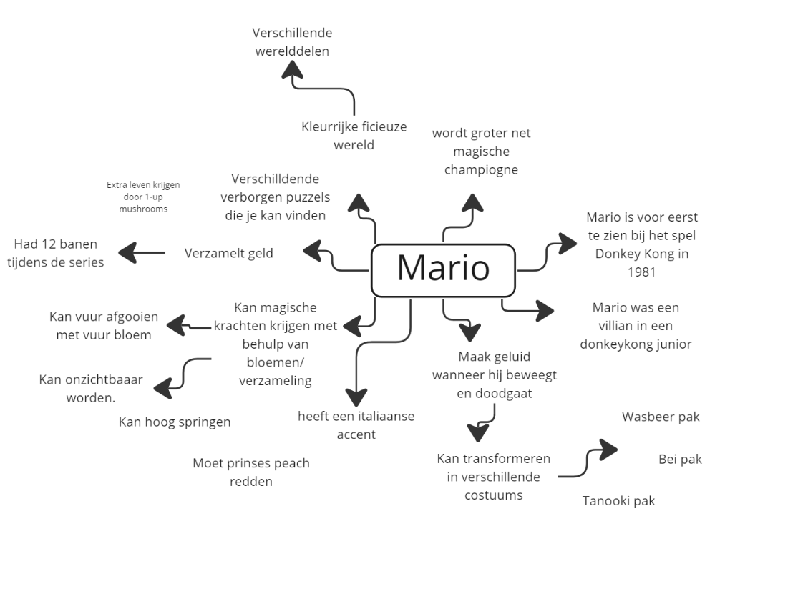
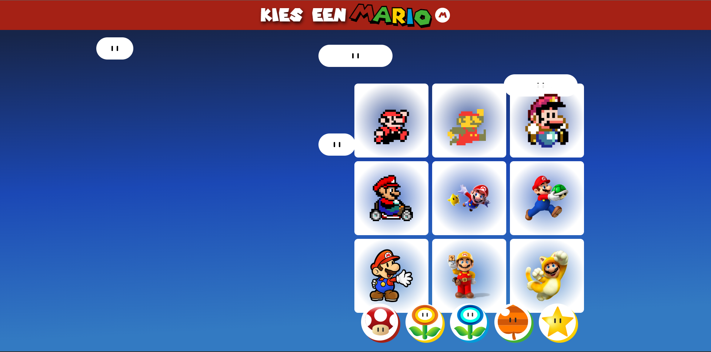

# Procesverslag

## Jij

### Ontwerper:

Keïsha Alexander

#### Je startniveau:

Blauw

# Je plan

<details open>
  <summary>De eerste versie/schets van je ontwerp & je persoonlijke uitdaging</summary>

### Mindmap van Mario

 

### De eerste versie schets:

  

### Mijn idee 1ste versie

Wat Mario uniek maakt is de mogelijkheid te transformeren met behulp van magische bloemen en producten. En dat wil ik ook toevoegen in mijn eigen werk.

De pagina bestaat van enkele blokken van afbeelding en animatie.
De blokken bevatten afbeelding van Mario in verschillende kostuums, maar ook versies van zijn originele pak. Aan de bovenste gedeelte heb je de nieuwste versie van mario met daarbij bijbehorende functionaliteiten. En hoe meer je naar beneden scrolt hoe ouder de versie wordt.

Als je op de content krijg je meer informatie te zien die bijhoort of kleine animaties met geluid erachter.

In de achtergrond heb je een kleurverloop van een lichte kleur naar een donkere kleur.

### Mijn idee versie 2


Wat Mario uniek maakt is de mogelijkheid te transformeren met behulp van magische bloemen en producten. En dat wil ik ook toevoegen in mijn eigen werk.

Het is de beginscherm van een spel waar je een karakter gaat kiezen. In mijn geval zijn de karakters verschillende versies van Mario's.

Dit geef aan de tijdlijn aan, bijvoorbeeld als je op een versie klikt dan verandert de achtergrond van het spel uit die tijd. Aan de linkerkant staat de details van de gekozen karkater met daarbij de power up pak, de spel waar die mario vandaan komt en de jaartaal van de spel.

Aan de andere kant heb je onderaan de power ups die ervoor zorgen dat Mario kan transformeren.

### Je ambitie:

Aan deze technieken/punten wil ik werken:

- Animeren met afbeeldingen zoals png en svg
- Ik wil geluid van Mario toevoegen binnen een animatie.
- Figuurtjes kunnen maken met puur css.
- Website interactiever maken met javascript

</details>

## Voortgang/Feedback 1

### Bekeken door: Hilal

<details>
  <summary>Mijn bevindingen + wijzigingen (minimaal 5)</summary>
 
 ### Bevinding 1: Concept nog niet bij Mario


  

Hierboven staat een voorbeeld van wat ik wilde bereiken met mijn eerste idee. Dus ik wilde een soort van collage maken van verschillende werelde versie die gord laat zien hoe mario heeft zich ontwikkeld als karakter. Maar ik had mijn eerste idee aan een medestudent laten zien en zij vond het passend bij het concept miste nog de speels karakter van Mario spellen, Want nu lijkt het meer van een stripboek dan een video game. Want ik wil naar voren laten brengen hoe Mario kan zich transformeren in verschillende kostuums door middel van power-ups.

### oplossing:


Door die idee naar voren te laten brengen heb ik een nieuwe schetsen gemaakt. Mijn idee is een soort van een kies karakter spel. Waar de gebruiker verschillende Mario's kan kiezen (tijdlijn) en dan aan de linkerkant zie je meer details over de gekozen karakters. Verder kun je onderaan met knopjes mario transformeren.

### Bevinding 2: Nog geen progressive disclosure

Een van de voorwaarde voor dit project is dat de tijdlijn een manier progressive disclosure toegepast moet worden. In mijn eerste schetsen had ik dat nog niet laten zien maar ik heb meer schetsen gemaakt waar ik een paar ideën had bedacht
In mijn eerste schets had ik niet een sterke progressive disclosure toegepast omdat en die moest ik beter gaan uitwerken.

#### Oplossing:

Mijn eerste oplossing zou de kleine vierkanten met animatie omdraaien naar de achterkant waar je de informatie over de mario kan zien. Maar ik heb een andere ideen uitgewerkt. Ikheb aan de zijkant een off-brand Nintendo Switch gemaakt, waar je de Mario groter kan laten zien.


In de eerste versie wilde ik met een `<button></button>` de Nintendo switch vanuit de linkerkant naar de juiste positie komen. Dit kon ik doen met css animatie maar door de layout die ik heb gebouwd is het niet mogelijk om dit te implementeren.

Ik heb de Nintendo onzichtbaar gemaakt met `display: none;` en met knop zichtbaar laten maken. Om de knop te laten werken heb ik een click event toegevoegd. Dus als je op de rode paddenstoel klikt dan open je de Nintendo Switch.

 


### Bevinding 3: Schets kan niet laten zien of het responsive is.


Toen ik mijn schets laten zien had ik een opmerking gekregen dat mijn webpagina layout te complex is om het responsive te maken. Ook kreeg ik een idee om de webpagina responsive maken voor grotere schermen. Dus hieronder staan ongeveer bepaalde schetsen die ik heb gemaakt

#### oplossing:


Voor mijn eerste idee dacht ik om de `<main>` te verdelen in drie kolommem met `display: flex`. En de `<body>` met `display: grid`.

Voor grotere chermen wil ik de margin van de `<main>` toenmen zodat de inhoud meer in het midden blijft. Vervolgens als de scherm groter is dan krijg je een achtergrond kleur.

In mijn laatste schets wilde ik de power-up-menu vertical zetten aan de zijkant door de beschikbare ruimte die er is.

### Bevinding 4: Laten zien dat Mario kan transformeren

In mijn idee heb ik aangegeven wat maakt mario uniek. Voor mij was dat Mario de mogelijkheid heeft om te transformeren met behulp van krachten in andere woorden power ups. Ik heb een idee gekregen om meer details toe te voegen in mijn ontwerp door verschillende knopjes te maken en als de gebruiker op een van die knopjes klikt, start een animatie of de achtergrond kleur verandert met een geluid daar achter. Dit is doen met javascript.

### oplossing:

Ik ga bijvoorbeeld aan de onderkant bij de footer een soort van menu maken met verschillende optie waar de gebruiker kan erop klikken. Als die op een van de power ups klikt dan kwam een soort van knipperende regeboog kleur met wat geluid erachter.


Hier is een screenshot van de power up men. Het bestaat de meest bekende krachten die mario gebruikt namelijk de rode paddenstoel, die zorgt dat Mario groter wordt. Maar ik heb dit button gebruikt om de Nintendo switch te verbergen. Verder heb je de vuur bloem, hier kan mario vuur aan zijn tegenstanders schieten. En zijn pak verandert wit en rood. Vervolgens heb je de ijs bloem kracht waar maar ijs kan schieten. De voorlaaste power up is een tanooki blad, tanooki betekent wasbeer in Japan en Mario krijgt een wasbeer kostuum waar hij met zijn start kan vliegen en tenslotte heb de sterretje kracht. Mario krijgt dan een regenboog kleur en hij krijgt meer snelheid en wordt sterker.

### Bevinding 5: Power up Menu maken

 

Ik heb de power up menu gemaakt op illustrator. Dan was het makkelijk om een svg van te maken. Ik heb op internet gezocht aan verschillende power-ups waar Mario zich kan transformeren.

</details>

## Voortgang/Feedback 2

### Bekeken door Ine

<details>
  <summary>Mijn bevindingen + wijzigingen (minimaal 5)</summary>
  
### Bevinding 1: Eerste versie ontwerp
   

Ik begon met het coderen van de eerste versie. Ik had nog geen plan over de kleurpallette maar wer over de layout dus ik heb ten eerste aan de layout gewerkt. Zoals het staat op me schets boven op. Ik heb hier eerst egbruikt gemaakt van grid en flex en helemaal aan het einde heb ik de gebruikt gemaakt van position voor onbelangrijke elementen.

De feedback die ik heb gekregen was dat de vormegving niet helemaal bij elkaar passen. Bijvoorbeeld ik heb op bepaalde onderdelen ronde hoeken en ergens ander scherpe hoeken. Verder zag de grijze nintendo switch niet verzorg uit maar in dit stadiun alleen gefocust op de layout van de webpagina.

### oplossing:

Ik heb ten eerste een kleur gezocht die passend is bij mario. Verder heb ik gezocht aan de begin scherm van een mario spel. En rood kwam meest naar voren.

   

Ik heb de blauwe kleurverloop verandert in rood oranje kleur. De mario menu heb ik de blokjes transparant gemaakt met een rode kleurverloop.

De nintendo switch heb ik een bordeaux kleur gegeven zodat het past bij de thema.

Verder vond ik de kleur te fel, dus ik heb de achtergrond kleur van de body weer verandert naar blauw. Want de blauw geef rust aan je ogen en het past beter bij een mario wereld spel.
De achtergrond van de mario's heb ik wat transparanter gemaakt om een luchtig gevoel te geven want eigenlijk zijn we in de lucht. Uiteindelijk heb ik alle vormen een ronde hoek gegeven zodat ze een een geheel vormen.

### Bevinding 2: Mario afbeeldingen zoeken en dezelfde verhouding geven

Om een tijdlijn te maken ging onderzoeken over de evolutie van Mario. Hiermee kan ik de visuele stijl van mario bekijken met de bijbehorende videospel. Daarmee heb ik verschillende mario versies gevonden die ik kon toevoegen in mijn eigen ontwerp. Ik heb eerst gekeken aan de volgorde van de evolutie en heb daarvan mario versies gezocht op basis van die periode. Verder heb ik de afbeelding gedownload als png en toegevoegd in mijn afbeelding bestandmap.

### Oplossing

De enige probleem met de afbeeldingen waren dat ze allemaal een ander verhouding hadden dus als de afbeelding wordt vervangen door een andere afbeelding dan wordt de nintendo switch kleiner.
Dus ik heb ze allemaal dezelfde height en width gegeven met daarbij `object-fit: contain;`.

### Bevinding 3: Responsive voor grote en kleine schermen

Volgende stap voor mijn ontwerp is de onderdelen responsive te maken. Ik was eerst van plan om het responsive te maken bij grotere schermen. Maar daarna heb ik besloten om ook voor kleine schermen te maken. Ik had bovenop hoe ik hem wilde hebben.

### Oplossing:

 

 Ik heb gebruikt gemaakt van media queries. Het is een makkelijke manier om je layout aan te passen bij bepaalde scherm grootte. 


 Voor kleine schermen heb ik  felx direction verandert in row enalles gingen gewoon onder elkaar te staan. DeMario Power up menu had een fixed position dus die moest ik eist naar rechts schuiven.

```
@media (max-width: 50em) {
  body {
    overflow-y: scroll;
  }

  main {
    display: flex;
    flex-direction: column;
  }
}

```


Voor de grotere schermen heb ik de margin toegevoegd  bij de `<main>`. Zodat de content meer in het midden blijft. De `<body>` had een grid dus ik heb de spatie tussen de grid items groter gemaakt dan lijkt het alsof de inhoud in het midden is gecentreerd. En als laatste is de power menu naar de rechterkant verplaatst op een verticale lijn. 
```
@media (min-width:100em) {
  body {
    gap: 5em;
  }

  main {
    /* background-color: red; */
    margin: 0 auto;
    width: 70%;
  }

  footer {
    top: 22%;
    right: 5em;
  }

  footer ul {
    flex-direction: column;
  }

}
```

### Bevinding 4: Progressive disclosure - Nintendo verbergen

Ik heb bovenaan bij voortgang 1 al genoemd wat  mijn plannen waren voor progressive disclosure. Ik heb uiteindelijk gekozen om de nintendo switch te verbergen en weergeven met een knop. Dus als je de webpagina laad dan zie je alleen de mario's menu. Zoals te zien is bij de foto onderaan. 

 

#### Oplossing:

Ten eerste had ik een "haal me" knop die lijkt als de wolken in de achtergrond maar door een beperking dus ik heb besloten om de rode paddenstoel te gebruiken. Om een feedworward te geven heb ik de paddenstoel bewegen zodat het aandacht trekt om daar te klikken. 


Als je op de verschillende mario's klikt dan krijg je meer informatie te zien over die mario en zijn veranderingen. 
 
 


 


### Bevinding 5: Nintendo moet volledig in beeld
Tijdens mij tweede voortgangsgesprek werd een kritiek gegeven dat door de grootte van mijn afbeelding kwam de nintendo niet helemaal in beeld en qua vormgeving. 

### Oplossing
Ik moest een manier vinden om alle afbeelding die binnen de Nintendo Switch moet komen dezelfde verhoudingen hebben. Ik kon de verhouding aanpassen op adobe photoshop maar ik had een makkelijker manier  gevonden die je met css kan doen en dat is met object fit. Eerst wel voor alle afbeelding voor de nintendo switch een hoogte en breedte aangeven. 
Dus de afbeelding blijven nu op dezelfde grootte.

</details>

## Voortgang/Feedback 3

<details>
  <summary>Mijn bevindingen + wijzigingen (minimaal 5)</summary>
  
  ### Bevinding 1: Dark mode toegevoegd
Ik wilde proberen om donkere modus in mijn ontwerp te implementeren. Want er wordt elke keer kwam die onderwerp naar voren en krijg nooit de kans om dat te doen. Dus deze keer heb ik wel geprobeerd. 

De enige onderdeel die verandert is de achtergrond van de `<body>` en de header. Ik heb gebruikt gemaakt van custom properties en media queries (prefer-color-scheme: dark)om die te maken.
  #### Licht modus 
   


  #### Donker modus
  
  


### Bevinding 2: Springende Mario
Mario spellen zijn bekend met verborgen paaseieren die de speler moet ontdekken zoals een geheime wereld of een bijzonders schat. Ik wilde ook paaseieren toevoegen in mijn concept. 

#### oplossing:
  

 Ik wilde dat een mario zich van de ene naar de andere kant springen. Ik wilde dat je een karakter zelf kan besturen met de muis en/of toesten bord. Dan lijkt het alsof de gebruiker een 2d  mario spel aan het spelen is. Ik ben nog niet zo technisch om die zelf te bouwen dus ik heb een andere alternatief gezocht.

Ik de  mario afbeelding  aan de onderkant gepositioneerd. Daarna heb ik in  de css twee animatie gemaakt. Een dat beweegt van links naar rechts en de andere animatie zorgt evoor dat de afbeelding springt. Met Javascript liet ik met de button de animatie pauseren en spelen. Het geeft een illusie dat mario aan het spelen bent. De knopje is  de joystick die te vinden is bij de nindtendo switch;


### Bevinding 3: Wisselende Beelden
De laatse onderdeel was om de website interactiever en dynamischer te maken met behulp van javascript. Ik heb javascript gebruikt bij buttons waar je acties moet uitvoeren. De buttons zijn onderdelen van de Nintendo Switch, de power up menu en de Mario selectie menu.

#### Power up menu
>Hier is een screenshot van de power up men. Het bestaat de meest bekende krachten die mario gebruikt namelijk de rode paddenstoel, die zorgt dat Mario groter wordt. Maar ik heb dit button gebruikt om de Nintendo switch te verbergen. Verder heb je de vuur bloem, hier kan mario vuur aan zijn tegenstanders schieten. En zijn pak verandert wit en rood. Vervolgens heb je de ijs bloem kracht waar maar ijs kan schieten. De voorlaaste power up is een tanooki blad, tanooki betekent wasbeer in Japan en Mario krijgt een wasbeer kostuum waar hij met zijn start kan vliegen en tenslotte heb de sterretje kracht. Mario krijgt dan een regenboog kleur en hij krijgt meer snelheid en wordt sterker.


Als je op de krachten klikt, dan kan je mario zien met zijn kostuum. Ook de naam verandert. 

 
 
 Hier is mario in een wasbeer pak.

 
  
  Hier is mario met vuur krachten.


### Bevinding 4: Geluid Toegevoegd
Een van mijn uitdagingen waren om geluid te gebruiken. Het is gelukt om die te doen. Om de geluid aan te zetten moet de gebruiker op de sterretje klikken. Als dat gebeurd dan verandert de achtergrond in een regeboog animatie terwijl het geluid zich afspeelt.

In meeste mario videogames speelt dit geluid af waneer  mario de ster pakt en ik dacht dat die een leuke toevoeging zou zijn.

 


### Bevinding 5: Betere naam geving voor de buttons

</details>

## Reflectie

<details>
  <summary>Mijn eindresultaat & persoonlijke ontwikkeling</summary>

### Je uitkomst - karakteristiek screenshot(s):

  

### Dit ging goed/Heb ik geleerd:

#### Donker modus
Met code leer je altijd iets nieuws. Dus  ja heb ik wat geleerd. Ten eerste kon ik eindelijk donker mode in een van projecten implementeren. Ik vond het geweldig. Volgende keer weer ik een toggle button maken waar je kan wisselen tussen de donkere en lichter modus.

#### Meer javascript te krijgen 
Vervolgens durfde ik meer dingen te proberen met Javascript. Nou tot nu is het niet zo efficient geschreven maar ik het begrijp het. Met javascript heb ik met knopjes verschillende dingen laten gebeuren zoals een animatie, foto verandering, geluid in de achtergrond en aanpassingen in de `<body>` achtergrond kleur. 


#### Meer animaties 
Voor de animaties ging ik niet over de top, maar had best veel geleerd onder andere de properties van animatie zoals `animation-fill-mode` waar je de animatie kan beindigen op bepaalde keyframes. Verder heb ik 

- Dark mode 
- Veel javascript
- Beter met animatie 
- Beter met Grid 


Korte omschrijving met plaatje(s)

  

### Dit was lastig/Is niet gelukt:

Korte omschrijving met plaatje(s)

- Figuurtje te maken met  css
- Wolken die van links naar rechts bewegen
- Complexe focus state 
- Om korte javascript te schrijven 


  
</details>

## Bronnenlijst

<details open>
<summary>continu bijhouden terwijl je werkt</summary>

#### Afbeeldingen van Mario

- By Miyamoto’s Own Account, Mario’s Profession Was Chosen - Super Mario Maker Artwork - Free Transparent PNG Clipart Images Download. (z.d.). ClipartMax.com. Geraadpleegd op 6 november 2022, van https://www.clipartmax.com/middle/m2i8N4N4A0m2i8b1_by-miyamotos-own-account-marios-profession-was-chosen-super-mario-maker-artwork/

- Evil Mario - Mario Kart Mario Pixel - Free Transparent PNG Download - PNGkey. (z.d.). PNGkey.com. Geraadpleegd op 6 november 2022, van https://www.pngkey.com/detail/u2w7a9q8e6u2e6u2_evil-mario-mario-kart-mario-pixel/

- Evolution Of Jumping Mario’s - Jumping Mario Pixel Art - Free Transparent PNG Clipart Images Download. (z.d.). ClipartMax.com. Geraadpleegd op 6 november 2022, van https://www.clipartmax.com/middle/m2H7N4d3d3Z5G6Z5_evolution-of-jumping-marios-jumping-mario-pixel-art/

- Mario Clip Art - Super Mario Bros Wii Png - Free Transparent PNG Clipart Images Download. (z.d.). ClipartMax.com. Geraadpleegd op 6 november 2022, van https://www.clipartmax.com/middle/m2i8K9b1G6m2b1Z5_mario-clip-art-super-mario-bros-wii-png/

- Super Mario 3d World Frog Suit - Super Mario 3d World Mario - Free Transparent PNG Clipart Images Download. (z.d.). ClipartMax.com. Geraadpleegd op 6 november 2022, van https://www.clipartmax.com/middle/m2i8G6G6b1Z5d3i8_super-mario-3d-world-frog-suit-super-mario-3d-world-mario/

- Mario Tanuki - Super Mario 3d Land Mario - Free Transparent PNG Clipart Images Download. (z.d.). ClipartMax.com. Geraadpleegd op 6 november 2022, van https://www.clipartmax.com/middle/m2i8d3d3G6Z5m2G6_mario-tanuki-super-mario-3d-land-mario/

- Mario Clip Art - Super Mario Bros Wii Png - Free Transparent PNG Clipart Images Download. (z.d.-b). ClipartMax.com. Geraadpleegd op 6 november 2022, van https://www.clipartmax.com/middle/m2i8K9b1G6m2b1Z5_mario-clip-art-super-mario-bros-wii-png/

---

#### Bron voor de code

- Animatie van de springende Mario https://stackoverflow.com/questions/47754999/css-animation-absolute-position-go-off-screen-to-right-and-come-back-from-left

- HTML color codes - https://htmlcolorcodes.com/color-names/

- Uitlijning bij de tekst bij "kies een mario" - https://css-tricks.com/almanac/properties/t/text-stroke/

- Achtergrond grafient - https://stackoverflow.com/questions/2869212/css3-gradient-background-set-on-body-doesnt-stretch-but-instead-repeats

- Gradient generator - https://cssgradient.io/

- Speech bubble vormen maken - https://codepen.io/RajRajeshDn/pen/oZdRJw

- Informatie over de evolutie van Mario - https://www.superluigibros.com/evolution-of-mario

- Prefer-color-scheme: dark - https: //designkojo.com/using-prefers-color-scheme-and-css-custom-properties

- CSS Filter() - https://developer.mozilla.org/en-US/docs/Web/CSS/filter

- Super Mario 256 Font - https://www.dafont.com/super-mario-256.font
</details>
